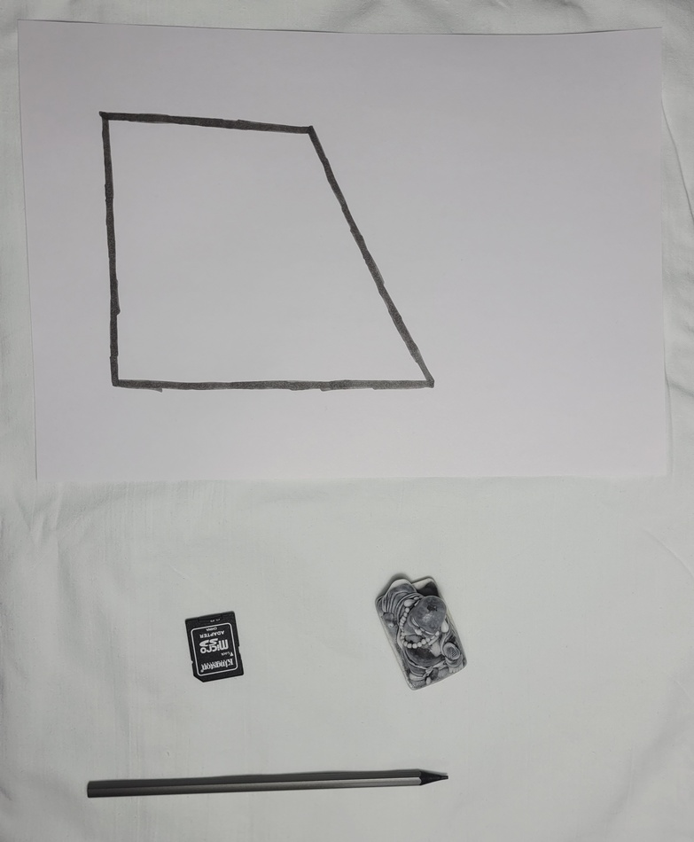
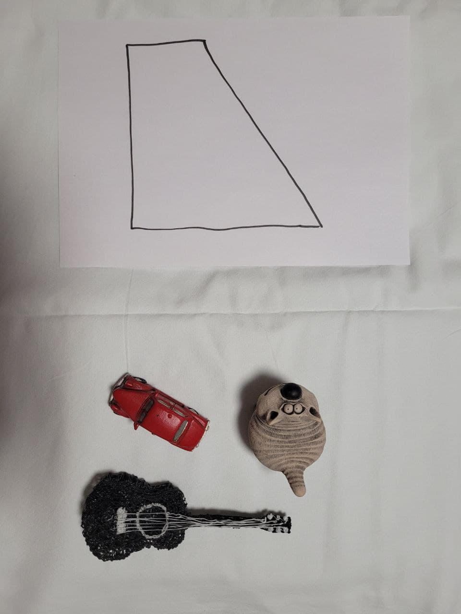
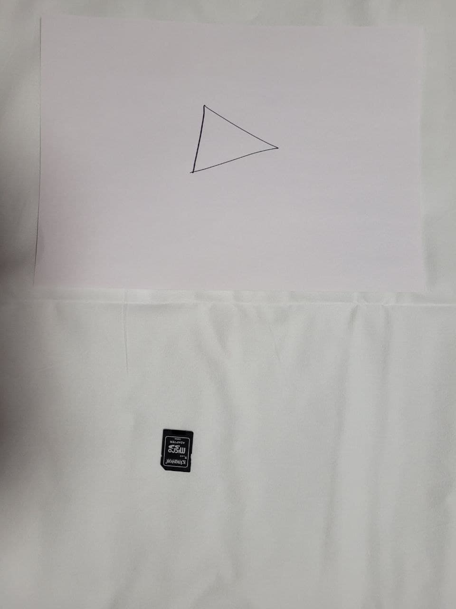
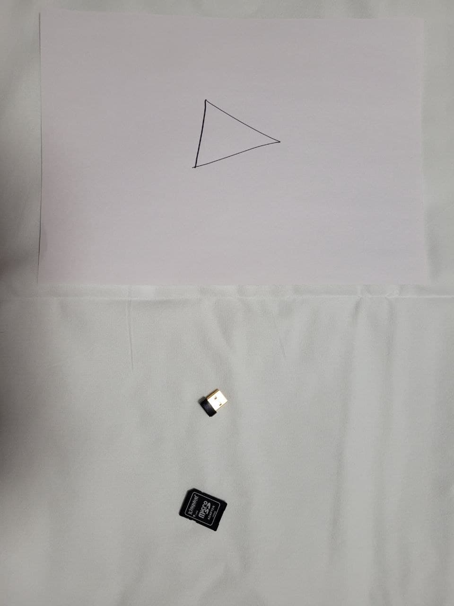
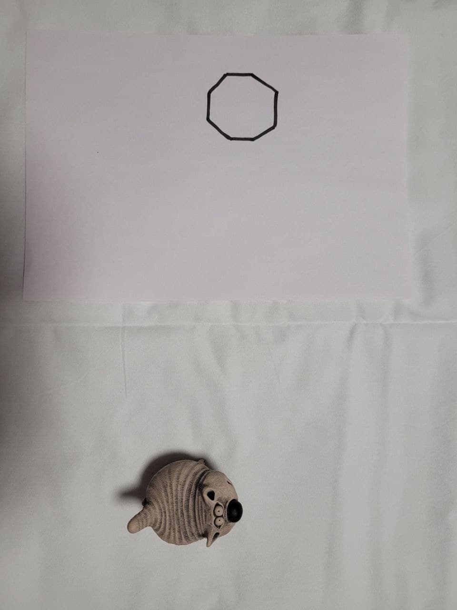
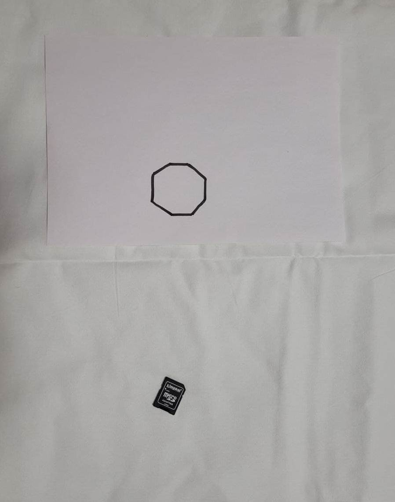
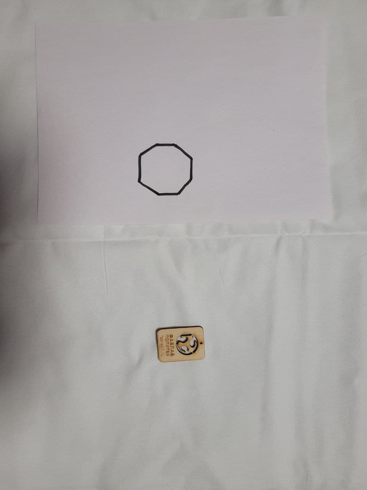
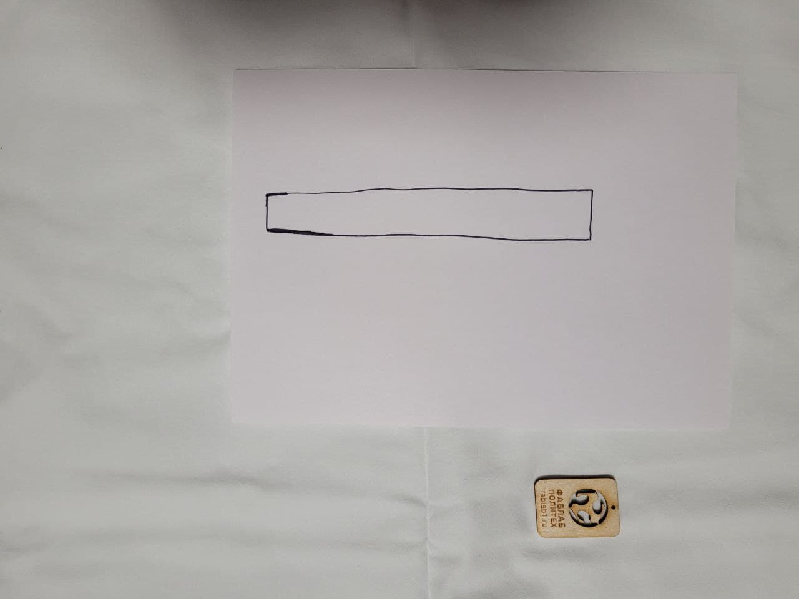
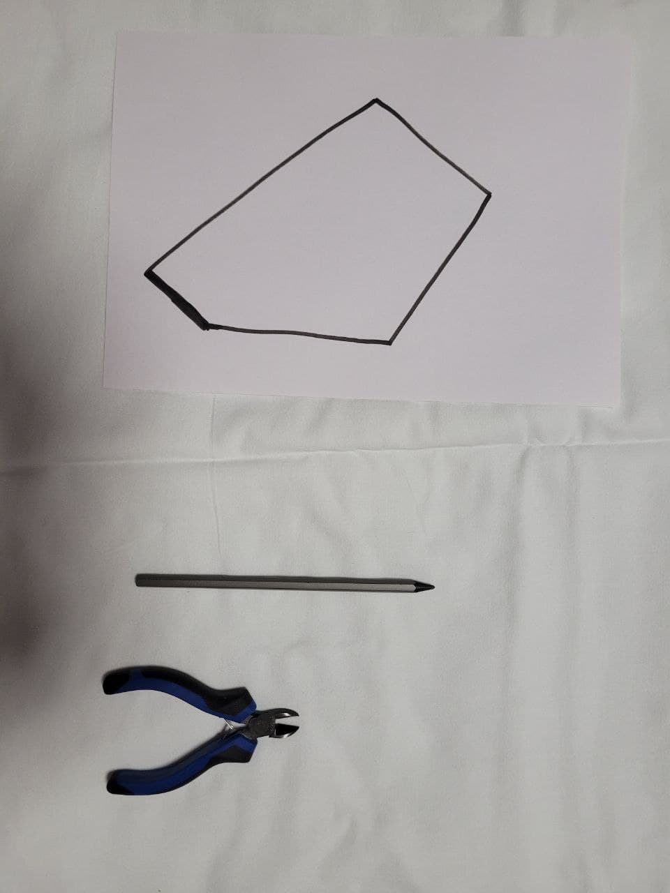

# Постановка задачи

## Общее описание

На вход алгоритму приходит фотография, на которой изображены предметы на светлой горизонтальной плоскоти и многоугольник. По данной фотографии требуется определить, возможно ли разместить предметы внутри многоугольника.

Фотографии предметов и текстура горизонтальной плоскости находятся в папке objects. Многоугольник, подающийся на вход, рисуется темным маркером на листе бумаги формата А4 рядом с предметами.
___
## Требования к входным данным

- Минимальное разрешение фотографий - 800x600. Качество должно быть таким, чтобы края объектов были четко различимы. Наличие артефактов от сжатия недопустимо.
- Высота съемки до метра. Угол расположения камеры должен быть близок к прямому: плоскость камеры располагается параллельно плоскости, в которой расположены объекты.
- Объекты должны быть разделимы: пересечения недопустимы. Не допускается расположение в кадре лишь части объекта.
- Тень не должна сливаться с объектами: ее интенивность должна быть такой, чтобы края объектов были четко различимы.
- На вход алгоритма допускаются только выпуклые многоугольники с числом вершин от 3 до 8.
- Объекты на фото должны быть разными. Допускается наличие на фотографии только предметов из папки objects.
- Допускается вращение объектов только относительно оси, перпендикулярной плоскости их расположения.
___
## Примеры входных данных

- [Фото объектов](https://csspbstu-my.sharepoint.com/:f:/g/personal/kirpichenko_sr_edu_spbstu_ru/Eovonqctwx9HjVUIjErmY3gBCt7gCK_gxrH34PH-iklPwQ?e=IpBMul)
- [Фото тестовых примеров](https://csspbstu-my.sharepoint.com/:f:/g/personal/kirpichenko_sr_edu_spbstu_ru/EuUh2HOABehMnjPG4Y_zOvUBZj28n9UiQTsjZTIZfnlSJA?e=LOupdF)

## Репрезентативные примеры входных данных

Сводная таблица

|Изображение|Описание особенности|
|:---:|:---:|
||Расположить карандаш можно только на большой диагонали|
|Большое количество больших предметов и большой многоугольник
|Предмет влезает в треугольник с очень небольшим запасом по площади
| Два небольших предмета почти влезают в треугольник
| Предмет полностью накрывает многоугольник
| Предмет можно расположить в многоугольнике под любым углом
| Предмет лишь немногим больше многоугольника
| Специально подобранная фигура под параметры предмета
|Несмотря на большую площадь, прямоугольник не вмещает предмет
|Предметы можно разместить в многоугольнике с малой вариабельностью, при этом в фигуре остается большая свободная площадь

___
# План решения задачи
## Базовый алгоритм 
Проверить необходимые и достаточные условия для повышения точности выдаваемого ответа при рассмотрении граничных случаев:
1. Необходимое условие: площадь многоугольника должна быть не меньше, чем сумма площадей предметов.
2. Необходимое условие: наибольшая диагональ многоугольника должна быть больше, чем длина самого длинного предмета.
3. Достаточное условие: составим внутреннюю оценку многоугольника прямоугольником и внешние оценки формы предметов. Пусть $A, B$ - длина и ширина полученной оценки многоугольника, $(a_1, b_1), ..., (a_n, b_n)$ - множество длин и ширин оценок формы предметов (предполагается, что у прямоугольника длина не меньше ширины). Тогда если $A \geq \sum_{i=1}^n a_i$ и $B \geq \max\limits_i b_i$, то предметы можно разместить в многоугольнике.

## Итерации по улучшению
1. При выполнении необходимых условий и не выполнении достаточных решить задачу с помощью жадного алгоритма, видимо, с помощью дискретизации фигур...
2. Учесть вращения предметов