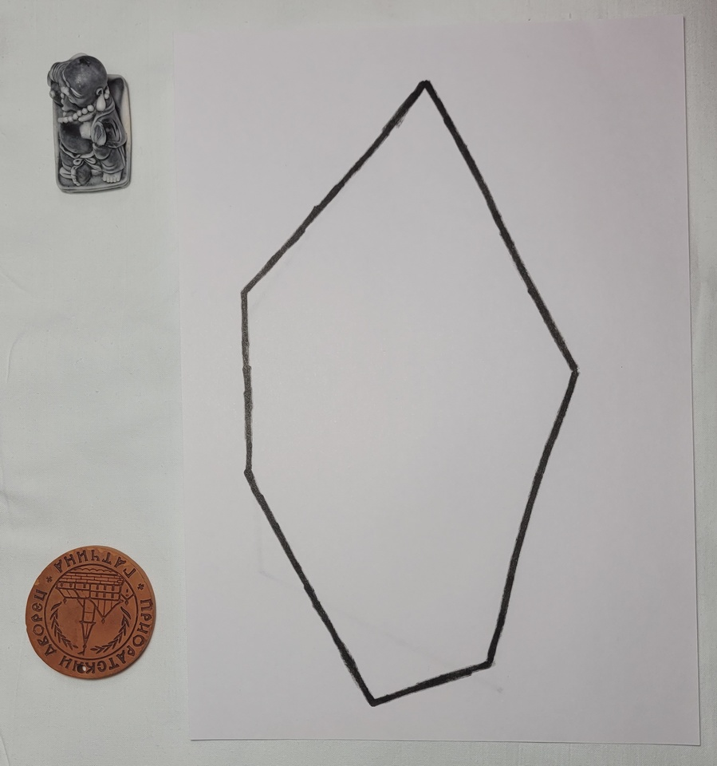

# Постановка задачи

## Общее описание

На вход алгоритму приходит фотография, на которой изображены предметы на светлой горизонтальной плоскоти и многоугольник. По данной фотографии требуется определить, возможно ли разместить предметы внутри многоугольника.

Фотографии предметов и текстура горизонтальной плоскости находятся в папке [Objects](https://csspbstu-my.sharepoint.com/:f:/g/personal/kirpichenko_sr_edu_spbstu_ru/Eovonqctwx9HjVUIjErmY3gBCt7gCK_gxrH34PH-iklPwQ?e=IpBMul). Многоугольник, подающийся на вход, рисуется темным маркером на листе бумаги формата А4 рядом с предметами.
___
## Требования к входным данным

- Минимальное разрешение фотографий - 800x600, максимальное - 1000х1000. Качество должно быть таким, чтобы края объектов были четко различимы. Наличие артефактов от сжатия недопустимо.
- Высота съемки - от 30 до 50 см. Угол расположения камеры должен быть близок к прямому: плоскость камеры располагается параллельно плоскости, в которой расположены объекты.
- Объекты должны быть хорошо разделимы: пересечения недопустимы. Не допускается расположение в кадре лишь части объекта.
- Тень не должна сливаться с объектами: ее интенивность должна быть такой, чтобы края объектов были по возможности четко различимы.
- На вход алгоритма допускаются только выпуклые многоугольники с числом вершин от 3 до 8.
- Объекты на фото должны быть разными. Допускается наличие на фотографии только предметов из папки [Objects](https://csspbstu-my.sharepoint.com/:f:/g/personal/kirpichenko_sr_edu_spbstu_ru/Eovonqctwx9HjVUIjErmY3gBCt7gCK_gxrH34PH-iklPwQ?e=IpBMul).
- Допускается вращение объектов только относительно оси, перпендикулярной плоскости их расположения.
___
## Примеры входных данных

- [Фото объектов](https://csspbstu-my.sharepoint.com/:f:/g/personal/kirpichenko_sr_edu_spbstu_ru/Eovonqctwx9HjVUIjErmY3gBCt7gCK_gxrH34PH-iklPwQ?e=IpBMul)
- [Фото тестовых примеров](https://csspbstu-my.sharepoint.com/:f:/g/personal/kirpichenko_sr_edu_spbstu_ru/EuUh2HOABehMnjPG4Y_zOvUBZj28n9UiQTsjZTIZfnlSJA?e=LOupdF)

## Репрезентативные примеры входных данных

Сводная таблица

|Изображение|Описание особенности|
|:---:|:---:|
||Расположить карандаш можно только на большой диагонали, его придется повернуть|
|Большое количество больших предметов и большой многоугольник
|Предметы влезают в треугольник с очень небольшим запасом по площади
| Прямоугольник нарисован специально под карандаш
| Несмотря на схожесть с предыдущим примером, карандаш не влазит в прямоугольник
| Предметы можно уложить только вложив гитару внутрь кусачек
| Предметы почти влезают в многоугольник
| Много мелких предметов
| Многоугольник нарисован тонким маркером
| Многоугольник нарисован жирным маркером

___
# План решения задачи
## Базовый алгоритм 
Проверить необходимые и достаточные условия для повышения точности выдаваемого ответа, а также скорости принятия решения при рассмотрении тривиальных случаев:
1. Необходимое условие: Площадь многоугольника должна быть не меньше, чем сумма площадей предметов.
2. Необходимое условие: Наибольшая диагональ многоугольника должна быть больше, чем длина самого длинного предмета.
3. Необходимое условие: Наибольшая ширина внешних оценок форм объектов должна быть меньше ширины внешней оценки многоугольника.
3. Достаточное условие: Составим внутреннюю оценку многоугольника прямоугольником и внешние оценки формы предметов. (Ввиду невозможности отображения tex формул в github, придется изъясняться словами, подробности в коде) Нужно попытаться расположить прямоугольные аппроксимации объектов в прямоугольной аппроксимации многоугольника максимально простым образом: друг за дружкой по ширине и по длине.

## Итерации по улучшению
1. Классификация объектов заняла очень много времени и попыток, но необходимо ее улучшить, чтобы во время укладки использовать не распознанные с ошибками контуры объектов на тестовых фото, а образцы с идеально отснятых изображений.
1. При выполнении необходимых условий и не выполнении достаточных решить задачу с помощью жадного алгоритма укладки объектов.
2. Хотя бы частично учесть вращения предметов.

## Результаты
Базовый алгоритм дает ответы (все правильные) в 20 случаях из 38. Если в остальных случаях выдавать ответ наугад, то на данной тестовой выборке достигается точность около 76%.